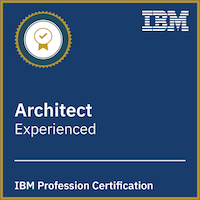

# Herzlich Willkommen / Welcome
Ich bin IT-Architekt [@IBM](https://www.ibm.com/de-de) mit Sitz in Ehningen. Ich bin aus technischer Sicht verantwortlich für IT Delivery Projekte. 
Beratung und Betreuung von Kunden in verschiedenen Projekten im Bereich Cloud Native, die hauptsächlich auf Google Cloud, Azure und Red Hat OpenShift laufen.

I’m an IT-Architect [@IBM](https://www.ibm.com/us-en) based in Ehningen. Responsible for IT delivery projects from technical site. Consulting and advising
clients in various projects on cloud native projects primarily running on Google Cloud, Azure and/or Red Hat OpenShift.

# Über mich
> „Scientists investigate that which already is; engineers create that which has never been.“
>
> *Albert Einstein*

## Publikationen
Hier eine Liste aller meiner bisherigen Publikationen:

* **IT-Innovationen** - *SSN: 1869-6457, BAND 22, SEITE 99 BIS 101* - [Link](https://www.hs-esslingen.de/fileadmin/media/Fakultaeten/it/SERVICE/IT-Innovationen/IT-Innovationen_Band22_WS1819.pdf) zur Veröffentlichung.
* **Mensch und Computer 2018** - *2018* - [Link](https://dl.gi.de/handle/20.500.12116/16776) zur Veröffentlichung.
* **A2A Smart World Symposium** - *21.06.2018* - [Link](https://www.akka-digital.com/unternehmen/termine-und-messen/a2a-2018.html) zur Veröffentlichung.
* **IT-Innovationen** - *SSN: 1869-6457, BAND 19, SEITE 80 BIS 82* - [Link](https://www.hs-esslingen.de/fileadmin/media/Fakultaeten/it/SERVICE/IT-Innovationen/IT-Innovationen_Band19_SS17.pdf) zur Veröffentlichung.

## Zertifikate
[Alle](https://www.credential.net/profile/larshelmuthprobst/wallet) Zertifikate anschauen.

<!--

  &nbsp;
  

## Badges
[Alle](https://www.youracclaim.com/users/lars-helmuth-probst/badges) Badges anschauen.

# Lebenslauf
Hier kommen die

# Portfolio
Hier kommen die
-->